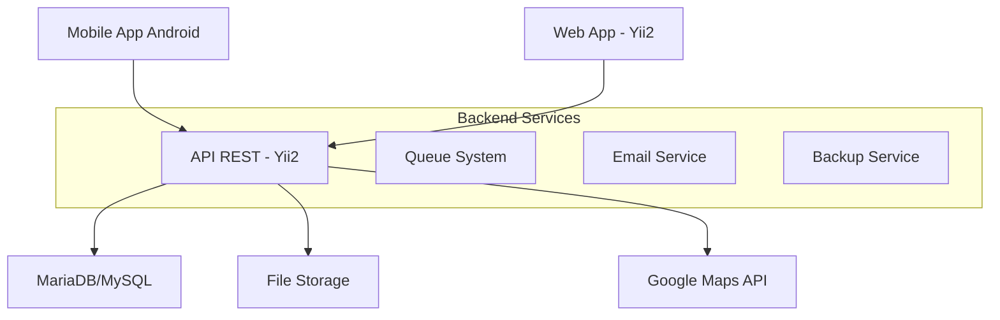

# 🚛 VeiGest - Sistema de Gestão de Frotas Empresariais

[](LICENSE)
[](https://php.net/)
[](https://www.yiiframework.com/)
[](https://mariadb.org/)

## 📋 Índice

- [Visão Geral](#-visão-geral)
- [Funcionalidades](#-funcionalidades)
- [Arquitetura](#-arquitetura)
- [Instalação](#-instalação)
- [Configuração](#-configuração)
- [Base de Dados](#-base-de-dados)
- [API Endpoints](#-api-endpoints)
- [Desenvolvimento](#-desenvolvimento)
- [Contribuição](#-contribuição)
- [Licença](#-licença)

## 🎯 Visão Geral

**VeiGest** é uma plataforma integrada para **gestão de frotas empresariais**, desenvolvida para conectar gestores e condutores num ecossistema digital centralizado. A solução combina uma aplicação web administrativa, API REST e aplicação móvel.

### 🎨 Principais Benefícios

- **💰 Redução de Custos**: Controlo detalhado de combustível e manutenções
- **📊 Visibilidade Total**: Dashboard com KPIs e relatórios em tempo real
- **🔔 Alertas Inteligentes**: Notificações automáticas para documentos e manutenções
- **📱 Mobilidade**: App móvel para condutores com GPS tracking
- **🔒 Segurança**: Controlo de acesso baseado em roles e auditoria completa

## ✨ Funcionalidades

### 🖥️ Painel Web (Gestores)
- **Dashboard**: KPIs, alertas e gráficos em tempo real
- **Gestão de Frota**: CRUD completo de veículos com fotos e documentos
- **Condutores**: Perfis, histórico e performance
- **Manutenções**: Histórico, agendamento e alertas automáticos
- **Documentos**: Upload, controlo de validade e notificações
- **Relatórios**: Exportação em PDF/Excel com filtros avançados
- **Tracking**: Visualização de rotas em mapa (Google Maps)

### 📱 App Mobile (Condutores)
- **Início de Viagem**: GPS tracking automático
- **Registo de Combustível**: Upload de recibos e fotos
- **Reportar Avarias**: Descrição e evidências fotográficas
- **Histórico**: Consulta de viagens anteriores
- **Notificações**: Alertas push para documentos e tarefas
- **Documentos do condutor**: Alterar documentos de utilizador.

### 🔧 API REST
- **Autenticação JWT**: Login seguro e refresh tokens
- **Endpoints RESTful**: CRUD para todas as entidades
- **Filtros e Paginação**: Consultas otimizadas
- **Rate Limiting**: Proteção contra abuso
- **Documentação**: Swagger/OpenAPI integrado

## 🔐 Sistema de Roles e Permissions

O VeiGest implementa um sistema robusto de controlo de acesso baseado na arquitetura **User → Role → Permission**:

### 🎭 Roles Disponíveis

| Role | Nível | Descrição |
|------|-------|-----------|
| **Super Administrador** | 100 | Acesso total, incluindo configurações críticas |
| **Administrador** | 90 | Acesso completo exceto configurações críticas |
| **Gestor de Frota** | 50 | Gestão de veículos, condutores e relatórios |
| **Gestor de Manutenção** | 40 | Manutenções, documentos e alertas |
| **Condutor Senior** | 20 | Condutor com permissões adicionais |
| **Condutor** | 10 | Acesso básico à app móvel |
| **Visualizador** | 5 | Apenas leitura de dados |

### 🔑 Módulos de Permissions

- **users**: Gestão de utilizadores e roles
- **vehicles**: CRUD de veículos e atribuições
- **drivers**: Perfis e histórico de condutores
- **maintenances**: Manutenções e agendamentos
- **documents**: Upload e gestão documental
- **fuel_logs**: Registos de combustível
- **routes**: Viagens e tracking GPS
- **alerts**: Sistema de alertas
- **reports**: Relatórios e exportações
- **system**: Configurações e auditoria
- **dashboard**: Painéis e KPIs

### 🛡️ Controlo de Acesso

```php
// Exemplo de verificação de permissão
if (Yii::$app->user->can('vehicles.create')) {
    // Utilizador pode criar veículos
}

// Verificação de role
if (Yii::$app->user->identity->hasRole('gestor')) {
    // Utilizador é gestor
}
```

## 🆕 Novas Funcionalidades

### 🏢 Sistema Multi-Empresa
O VeiGest agora suporta **múltiplas empresas** numa única instalação:

- **Isolamento Completo**: Dados totalmente separados entre empresas
- **Configurações Específicas**: Settings personalizados por organização  
- **Planos de Subscrição**: Básico, Profissional e Enterprise
- **Limites Configuráveis**: Controlo de veículos e condutores por empresa
- **Gestão Centralizada**: Administração unificada de múltiplas empresas

### 📁 Gestão Avançada de Ficheiros
Sistema robusto para gestão de ficheiros com suporte a CDN:

- **Multi-Servidor**: FileStash, AWS S3, Google Cloud, Azure
- **Integridade**: Verificação MD5 e SHA256 automática
- **Metadados**: Tags, categorias e metadados personalizados
- **Controlo de Acesso**: Ficheiros públicos, privados ou restritos
- **Deduplicação**: Evita ficheiros duplicados por empresa

### 📄 Sistema de Documentos Melhorado
Gestão inteligente de documentos com workflow avançado:

- **Versionamento**: Histórico completo de versões
- **Alertas Inteligentes**: Notificações antes da expiração
- **Renovação Automática**: Configurável por tipo de documento
- **Auditoria Completa**: Controlo total de criação/modificação
- **Classificação**: Categorias, prioridades e tags flexíveis

📖 **Documentação detalhada**: [MULTI_EMPRESA_FICHEIROS.md](database/MULTI_EMPRESA_FICHEIROS.md)

## 🏗️ Arquitetura



### Stack Tecnológica

| Camada | Tecnologia | Versão |
|--------|------------|--------|
| **Backend** | PHP + Yii2 Framework | PHP 8.0+ / Yii 2.0.49+ |
| **Frontend** | Yii2 MVC + Bootstrap | Bootstrap 5 |
| **Mobile** | Android SDK | API Level 21+ |
| **Database** | MariaDB/MySQL | 10.5+ / 8.0+ |
| **Web Server** | Nginx + PHP-FPM | - |
| **Cache** | Redis | 6.0+ |
| **Queue** | Yii2 Queue | - |

## 🚀 Instalação

### Pré-requisitos

- PHP 8.0+
- Composer
- MariaDB/MySQL 10.5+
- Node.js 16+ (para assets)
- Git

### 1. Clonar o Repositório

```bash
git clone https://github.com/seu-usuario/veigest.git
cd veigest
```

### 2. Instalar Dependências

```bash
# Dependências PHP
composer install

# Assets frontend
npm install
npm run build
```

### 3. Configurar Ambiente

```bash
# Copiar arquivo de configuração
cp .env.example .env

# Editar configurações
nano .env
```

### 4. Base de Dados

```bash
# Criar base de dados
mysql -u root -p < database/schema.sql

# Executar migrations
php yii migrate

# Carregar dados de exemplo (opcional)
mysql -u root -p veigest < database/seeders.sql
```

### 5. Configurar Permissões

```bash
# Diretórios de runtime
chmod -R 777 backend/runtime
chmod -R 777 frontend/runtime
chmod -R 777 console/runtime

# Diretório de uploads
chmod -R 777 frontend/web/uploads
```

## ⚙️ Configuração

### Arquivo .env

```env
# Database
DB_HOST=localhost
DB_NAME=veigest
DB_USER=veigest_user
DB_PASS=senha_segura

# Google Maps API
GOOGLE_MAPS_API_KEY=sua_chave_api

# Email SMTP
SMTP_HOST=mail.exemplo.com
SMTP_PORT=587
SMTP_USER=noreply@exemplo.com
SMTP_PASS=senha_email

# JWT
JWT_SECRET=chave_secreta_jwt
JWT_EXPIRE=3600

# Storage
UPLOAD_PATH=/var/www/uploads
MAX_FILE_SIZE=10485760
```

### Configuração do Servidor Web

#### Nginx

```nginx
server {
    listen 80;
    server_name veigest.local;
    root /var/www/veigest/frontend/web;
    index index.php;

    location / {
        try_files $uri $uri/ /index.php?$args;
    }

    location ~ \.php$ {
        fastcgi_pass unix:/var/run/php/php8.0-fpm.sock;
        fastcgi_index index.php;
        fastcgi_param SCRIPT_FILENAME $document_root$fastcgi_script_name;
        include fastcgi_params;
    }
}

# API Backend
server {
    listen 80;
    server_name api.veigest.local;
    root /var/www/veigest/backend/web;
    index index.php;

    location / {
        try_files $uri $uri/ /index.php?$args;
    }

    location ~ \.php$ {
        fastcgi_pass unix:/var/run/php/php8.0-fpm.sock;
        fastcgi_index index.php;
        fastcgi_param SCRIPT_FILENAME $document_root$fastcgi_script_name;
        include fastcgi_params;
    }
}
```

## 🗄️ Base de Dados

### Estrutura

A base de dados está organizada em módulos funcionais:

- **👥 Autenticação**: `users`, `drivers_profiles`
- **🚗 Frota**: `vehicles`, `maintenances`, `documents`
- **📊 Operações**: `fuel_logs`, `routes`, `gps_points`
- **🔔 Notificações**: `alerts`
- **📈 Relatórios**: `reports`, `activity_logs`
- **⚙️ Sistema**: `settings`, `support_tickets`

### Diagrama ER

Consulte [`database/ER_Diagram.md`](database/ER_Diagram.md) para o diagrama completo.

### Migrations

```bash
# Executar todas as migrations
php yii migrate

# Criar nova migration
php yii migrate/create nome_da_migration

# Reverter última migration
php yii migrate/down 1
```

## 🔌 API Endpoints

### Autenticação

```http
POST /api/auth/login
POST /api/auth/refresh
POST /api/auth/logout
```

### Veículos

```http
GET    /api/vehicles          # Listar veículos
POST   /api/vehicles          # Criar veículo
GET    /api/vehicles/{id}     # Obter veículo
PUT    /api/vehicles/{id}     # Atualizar veículo
DELETE /api/vehicles/{id}     # Remover veículo
```

### Rotas

```http
GET    /api/routes            # Listar rotas
POST   /api/routes            # Iniciar rota
PUT    /api/routes/{id}       # Finalizar rota
GET    /api/routes/{id}/gps   # Pontos GPS da rota
```

### Documentação Completa

Acesse `/api/doc` para a documentação interativa Swagger.

## 💻 Desenvolvimento

### Estrutura do Projeto

```
veigest/
├── backend/                 # API REST
│   ├── controllers/         # Controllers da API
│   ├── models/             # Models ActiveRecord
│   └── modules/            # Módulos da API
├── frontend/               # Aplicação Web
│   ├── controllers/        # Controllers web
│   ├── models/            # Models específicos
│   ├── views/             # Templates Twig/PHP
│   └── web/               # Assets públicos
├── mobile/                # App Android
│   ├── app/src/main/java/ # Código Java/Kotlin
│   └── app/src/main/res/  # Resources Android
├── common/                # Código partilhado
│   ├── config/           # Configurações
│   ├── models/           # Models base
│   └── mail/             # Templates email
├── console/              # Comandos CLI
├── database/             # Scripts DB
└── docs/                 # Documentação
```

### Comandos Úteis

```bash
# Iniciar servidor de desenvolvimento
php yii serve --port=8080

# Executar testes
vendor/bin/codecept run

# Gerar documentação API
php yii api-doc/generate

# Limpar cache
php yii cache/flush-all

# Backup da base de dados
php yii backup/create

# Processar queue de jobs
php yii queue/run
```

### Coding Standards

- **PSR-12** para PHP
- **Google Java Style Guide** para Android
- **Comentários em português** para documentação
- **Commits em inglês** seguindo Conventional Commits

### Git Workflow

```bash
# Feature branch
git checkout -b feature/nova-funcionalidade

# Commits
git commit -m "feat: adicionar gestão de combustível"

# Pull request
git push origin feature/nova-funcionalidade
```

## 🧪 Testes

### Executar Testes

```bash
# Todos os testes
vendor/bin/codecept run

# Testes unitários
vendor/bin/codecept run unit

# Testes funcionais
vendor/bin/codecept run functional

# Testes de API
vendor/bin/codecept run api
```

### Coverage

```bash
vendor/bin/codecept run --coverage --coverage-html
```

## 📊 Monitorização

### Logs

- **Aplicação**: `runtime/logs/app.log`
- **Erros**: `runtime/logs/error.log`
- **Base de Dados**: Tabela `activity_logs`

### Métricas

- Performance via Yii2 Debug Toolbar
- Monitoring de queries lentas
- Alertas automáticos para erros críticos

## 🚀 Deploy

### Produção

```bash
# Build para produção
composer install --no-dev --optimize-autoloader
npm run build:prod

# Configurar variáveis de ambiente
cp .env.production .env

# Executar migrations
php yii migrate --interactive=0

# Configurar cron jobs
crontab -e
```

### Docker

```bash
# Build
docker-compose build

# Start
docker-compose up -d

# Logs
docker-compose logs -f
```

## 🤝 Contribuição

1. Fork o projeto
2. Crie uma branch para a funcionalidade (`git checkout -b feature/AmazingFeature`)
3. Commit as mudanças (`git commit -m 'feat: add some AmazingFeature'`)
4. Push para a branch (`git push origin feature/AmazingFeature`)
5. Abra um Pull Request

### Diretrizes

- Mantenha o código limpo e documentado
- Escreva testes para novas funcionalidades
- Siga os padrões de código estabelecidos
- Atualize a documentação quando necessário

## 📞 Suporte

- **Documentação**: [Wiki do Projeto](docs/)
- **Issues**: [GitHub Issues](https://github.com/seu-usuario/veigest/issues)
- **Email**: dev@veigest.com

## 📜 Licença

Este projeto é propriedade privada. Todos os direitos reservados.

---

**VeiGest** - Gestão de Frotas Inteligente © 2025
