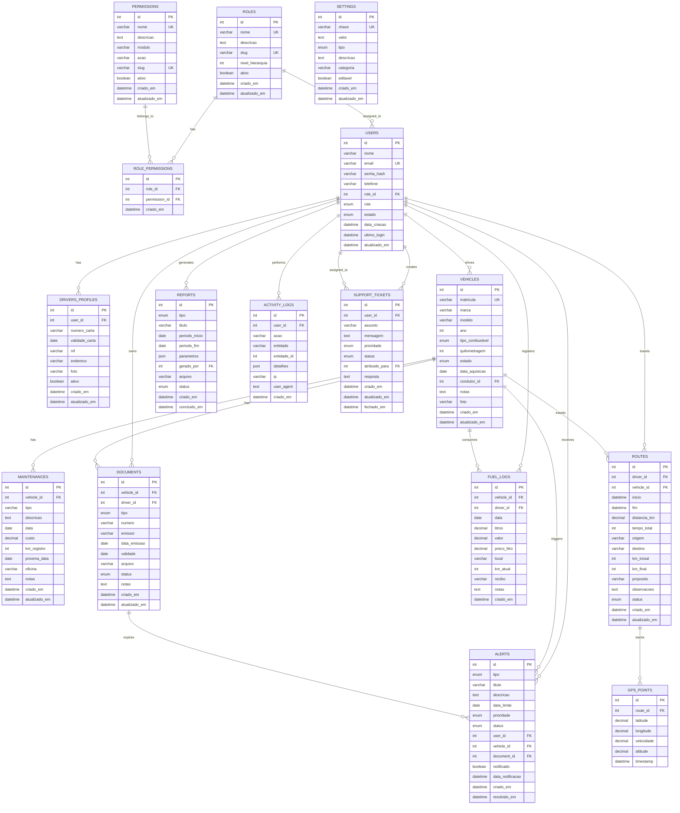

# 📊 Diagrama ER - VeiGest

## Modelo Entidade-Relacionamento

## Relacionamentos Principais

### 🔐 Sistema de Roles e Permissions

#### 1:N (Um para Muitos)
- `ROLES` → `USERS` (Um role pode ser atribuído a vários usuários)
- `ROLES` → `ROLE_PERMISSIONS` (Um role pode ter várias permissões)
- `PERMISSIONS` → `ROLE_PERMISSIONS` (Uma permissão pode pertencer a vários roles)

#### M:N (Muitos para Muitos) - Tabela Intermediária
- `ROLES` ←→ `PERMISSIONS` através de `ROLE_PERMISSIONS` (Roles têm múltiplas permissões e permissões podem ser atribuídas a múltiplos roles)

### 👥 Relacionamentos Tradicionais

#### 1:1 (Um para Um)
- `USERS` ←→ `DRIVERS_PROFILES` (Um usuário condutor tem um perfil)

#### 1:N (Um para Muitos)
- `USERS` → `VEHICLES` (Um condutor pode ter vários veículos atribuídos)
- `VEHICLES` → `MAINTENANCES` (Um veículo tem várias manutenções)
- `VEHICLES` → `DOCUMENTS` (Um veículo tem vários documentos)
- `VEHICLES` → `FUEL_LOGS` (Um veículo tem vários abastecimentos)
- `VEHICLES` → `ROUTES` (Um veículo faz várias viagens)
- `ROUTES` → `GPS_POINTS` (Uma rota tem vários pontos GPS)
- `USERS` → `FUEL_LOGS` (Um condutor registra vários abastecimentos)
- `USERS` → `ROUTES` (Um condutor faz várias viagens)
- `USERS` → `ALERTS` (Um usuário recebe vários alertas)
- `USERS` → `REPORTS` (Um gestor gera vários relatórios)
- `USERS` → `ACTIVITY_LOGS` (Um usuário gera várias atividades)
- `USERS` → `SUPPORT_TICKETS` (Um usuário cria vários tickets)

#### M:N (Muitos para Muitos) - Através de tabelas intermediárias
- `VEHICLES` ←→ `USERS` através de histórico em `ROUTES` (Vários condutores podem usar o mesmo veículo ao longo do tempo)

## Índices Recomendados

### Índices Únicos
- `users.email`
- `vehicles.matricula`
- `settings.chave`
- `roles.nome`
- `roles.slug`
- `permissions.nome`
- `permissions.slug`
- `role_permissions(role_id, permission_id)` - Evitar duplicatas

### Índices de Performance
- `fuel_logs(data, vehicle_id)` - Para relatórios de consumo
- `routes(driver_id, inicio)` - Para histórico de condutores
- `alerts(status, data_limite)` - Para alertas ativos
- `activity_logs(user_id, criado_em)` - Para auditoria
- `documents(validade, status)` - Para documentos expirados
- `users(role_id)` - Para consultas por role
- `permissions(modulo, acao)` - Para consultas por módulo e ação
- `roles(nivel_hierarquia)` - Para ordenação hierárquica

## Constraints e Regras de Negócio

### Check Constraints
- `documents`: Deve ter pelo menos `vehicle_id` OU `driver_id`
- `fuel_logs`: `litros > 0` e `valor > 0`
- `routes`: `fim >= inicio` (quando preenchido)
- `vehicles`: `ano >= 1900` e `ano <= YEAR(CURDATE())`

### Triggers Sugeridas
- **Auto-alertas**: Criar alertas automáticos quando documentos estão próximos do vencimento
- **Update quilometragem**: Atualizar quilometragem do veículo quando rota é finalizada
- **Activity logging**: Registrar automaticamente ações importantes

### Procedimentos Armazenados Sugeridos
- `CalcularCustoTotalVeiculo(vehicle_id, data_inicio, data_fim)`
- `GerarRelatorioConsumo(vehicle_id, periodo)`
- `VerificarDocumentosVencidos(dias_antecedencia)`
