# 🗄️ VeiGest Database - Diagrama ER (Mermaid)

## Versão: 3.0 (Ultra-Lean) - Revisão 2 + Rotas GPS
**Data:** 6 de novembro de 2025  
**Atualização:** Adicionado sistema de rastreamento GPS e rotas

---

## 📊 Diagrama Entidade-Relacionamento Completo

```mermaid
erDiagram
    %% ==========================================
    %% TABELAS PRINCIPAIS
    %% ==========================================
    
    companies ||--o{ users : "tem"
    companies ||--o{ vehicles : "possui"
    companies ||--o{ files : "armazena"
    companies ||--o{ documents : "gerencia"
    companies ||--o{ maintenances : "regista"
    companies ||--o{ fuel_logs : "controla"
    companies ||--o{ alerts : "recebe"
    companies ||--o{ activity_logs : "audita"
    companies ||--o{ routes : "rastreia"
    
    users ||--o{ vehicles : "conduz"
    users ||--o{ maintenances : "regista"
    users ||--o{ files : "carrega"
    users ||--o{ fuel_logs : "regista"
    users ||--o{ activity_logs : "executa"
    users ||--o{ auth_assignment : "tem_papel"
    users ||--o{ routes : "conduz_rota"
    
    vehicles ||--o{ maintenances : "recebe"
    vehicles ||--o{ documents : "possui"
    vehicles ||--o{ fuel_logs : "abastece"
    vehicles ||--o{ routes : "percorre"
    
    routes ||--o{ gps_entries : "registra_pontos"
    
    files ||--o{ documents : "anexa"
    
    documents ||--o{ users : "pertence_a_condutor"
    
    %% ==========================================
    %% RBAC YII2
    %% ==========================================
    
    auth_item ||--o{ auth_item_child : "parent"
    auth_item ||--o{ auth_item_child : "child"
    auth_item ||--o{ auth_assignment : "atribui"
    auth_item ||--o{ auth_rule : "usa_regra"

    companies {
        int id PK "AUTO_INCREMENT"
        string nome "NOT NULL, UNIQUE"
        string nif "UNIQUE"
        string email
        string telefone
        string morada
        string cidade
        string codigo_postal
        json configuracoes "Configurações JSON"
        boolean ativo "DEFAULT TRUE"
        datetime created_at
        datetime updated_at
    }

    users {
        int id PK "AUTO_INCREMENT"
        int company_id FK "NOT NULL"
        string nome "NOT NULL"
        string email "UNIQUE, NOT NULL"
        string password_hash "NOT NULL"
        string telefone
        string numero_carta "Carta condução (se condutor)"
        date validade_carta "Validade carta (se condutor)"
        string foto "URL foto perfil"
        enum status "ativo, inativo, suspenso"
        string auth_key
        string password_reset_token
        datetime created_at
        datetime updated_at
    }

    vehicles {
        int id PK "AUTO_INCREMENT"
        int company_id FK "NOT NULL"
        int driver_id FK "Condutor atual"
        string matricula "UNIQUE, NOT NULL"
        string marca
        string modelo
        int ano
        string tipo "ligeiro, pesado, mota, etc"
        string combustivel "gasolina, diesel, elétrico, etc"
        int km_atual
        date data_aquisicao
        enum status "ativo, manutencao, inativo"
        datetime created_at
        datetime updated_at
    }

    maintenances {
        int id PK "AUTO_INCREMENT"
        int company_id FK "NOT NULL"
        int vehicle_id FK "NOT NULL"
        int user_id FK "Quem registou"
        enum tipo "preventiva, corretiva, inspeção, outro"
        string descricao "NOT NULL"
        decimal custo
        int km_realizada
        date data_manutencao "NOT NULL"
        date proxima_manutencao
        enum status "agendada, em_curso, concluida, cancelada"
        datetime created_at
        datetime updated_at
    }

    files {
        int id PK "AUTO_INCREMENT"
        int company_id FK "NOT NULL"
        string nome_original "NOT NULL"
        int tamanho "bytes"
        string caminho "NOT NULL"
        int uploaded_by FK "user_id"
        datetime created_at
    }

    documents {
        int id PK "AUTO_INCREMENT"
        int company_id FK "NOT NULL"
        int file_id FK "NOT NULL"
        int vehicle_id FK
        int driver_id FK "user_id"
        enum tipo "seguro, inspecao, livrete, carta_conducao, contrato_aluguer, outro"
        date data_validade
        enum status "valido, expirado, cancelado"
        text notas "Informações adicionais"
        datetime created_at
        datetime updated_at
    }

    fuel_logs {
        int id PK "AUTO_INCREMENT"
        int company_id FK "NOT NULL"
        int vehicle_id FK "NOT NULL"
        int user_id FK "Quem abasteceu"
        date data_abastecimento "NOT NULL"
        decimal litros "NOT NULL"
        decimal preco_litro
        decimal custo_total
        int km_atual "Quilometragem no abastecimento"
        text notas "Ex: posto, desconto, etc"
        datetime created_at
    }

    alerts {
        int id PK "AUTO_INCREMENT"
        int company_id FK "NOT NULL"
        enum tipo "documento_expira, manutencao_agendada, outro"
        string titulo "NOT NULL"
        text mensagem
        json detalhes "Dados contextuais (vehicle_id, document_id, etc)"
        enum status "pendente, lido, resolvido"
        datetime created_at
    }

    activity_logs {
        int id PK "AUTO_INCREMENT"
        int company_id FK "NOT NULL"
        int user_id FK
        string acao "NOT NULL"
        string tabela
        int registro_id
        text dados_antigos "JSON"
        text dados_novos "JSON"
        string ip_address
        datetime created_at
    }

    routes {
        int id PK "AUTO_INCREMENT"
        int company_id FK "NOT NULL"
        int vehicle_id FK "NOT NULL"
        int driver_id FK "NOT NULL"
        datetime inicio "Data/hora início"
        datetime fim "Data/hora fim (NULL se em andamento)"
        int km_inicial "Quilometragem inicial"
        int km_final "Quilometragem final"
        string origem "Local de partida"
        string destino "Local de chegada"
        decimal distancia_km "Distância calculada"
        enum status "em_andamento, concluida, cancelada"
        text notas
        datetime created_at
        datetime updated_at
    }

    gps_entries {
        bigint id PK "AUTO_INCREMENT"
        int route_id FK "NOT NULL"
        decimal latitude "Latitude -90 a 90"
        decimal longitude "Longitude -180 a 180"
        datetime timestamp "Momento do registo"
        decimal velocidade "Velocidade em km/h"
        decimal altitude "Altitude em metros"
        decimal precisao "Precisão GPS em metros"
    }

    %% ==========================================
    %% RBAC YII2 TABLES
    %% ==========================================

    auth_rule {
        string name PK "VARCHAR(64)"
        text data "Regra serializada"
        datetime created_at
        datetime updated_at
    }

    auth_item {
        string name PK "VARCHAR(64)"
        int type "NOT NULL (1=role, 2=permission)"
        text description
        string rule_name FK
        text data "Dados adicionais"
        datetime created_at
        datetime updated_at
    }

    auth_item_child {
        string parent PK,FK "VARCHAR(64)"
        string child PK,FK "VARCHAR(64)"
    }

    auth_assignment {
        string item_name PK,FK "VARCHAR(64)"
        string user_id PK "VARCHAR(64)"
        datetime created_at
    }
```

---

## 🎨 Diagrama por Módulos

### 1️⃣ Módulo Core (Empresas & Utilizadores)

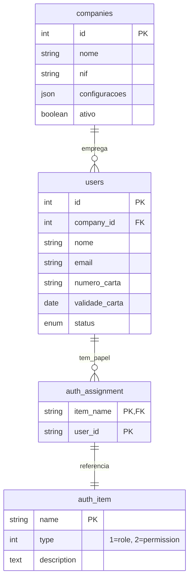

---

### 2️⃣ Módulo Frota (Veículos & Condutores)

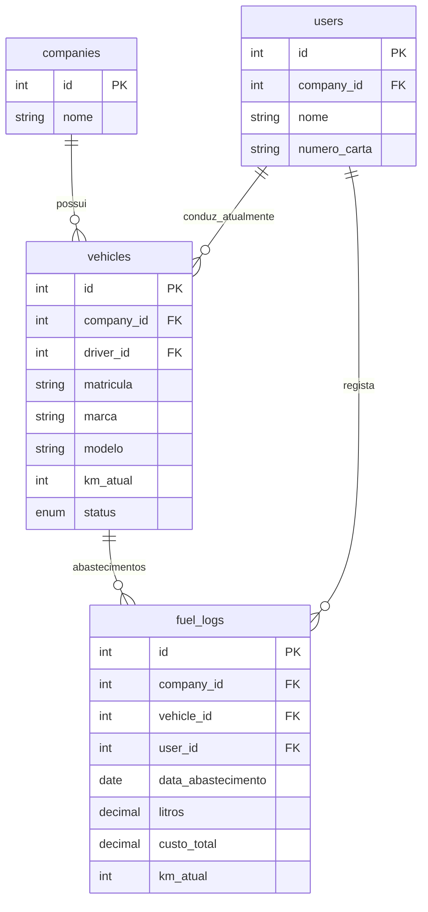

---

### 3️⃣ Módulo Manutenções

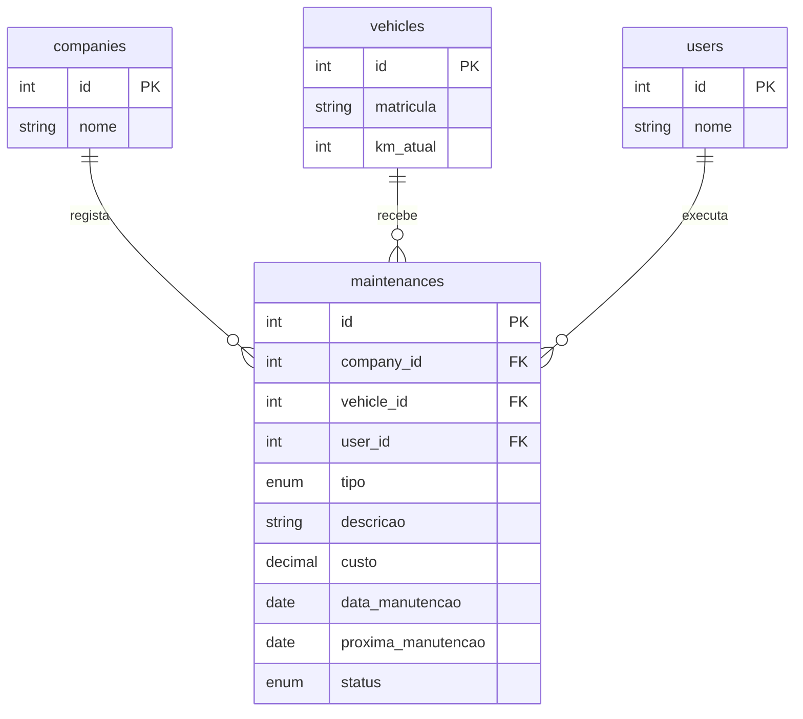

---

### 4️⃣ Módulo Documentos & Ficheiros

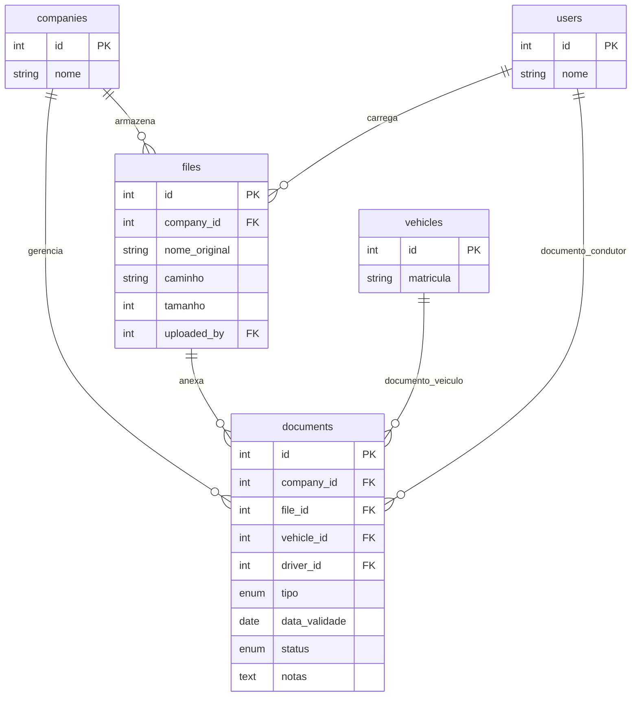

---

### 5️⃣ Módulo Alertas & Auditoria

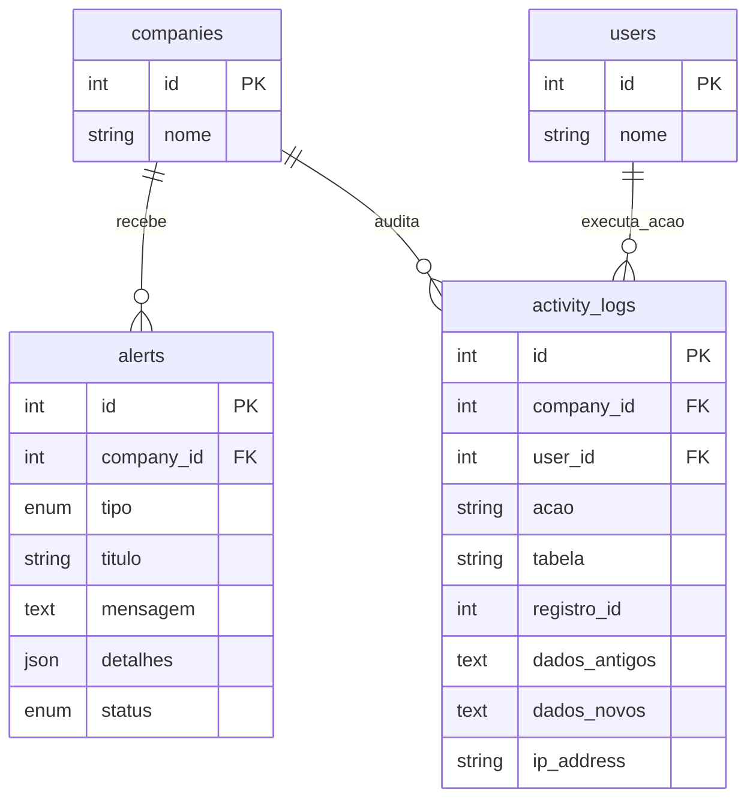

---

### 6️⃣ Módulo Rotas & GPS

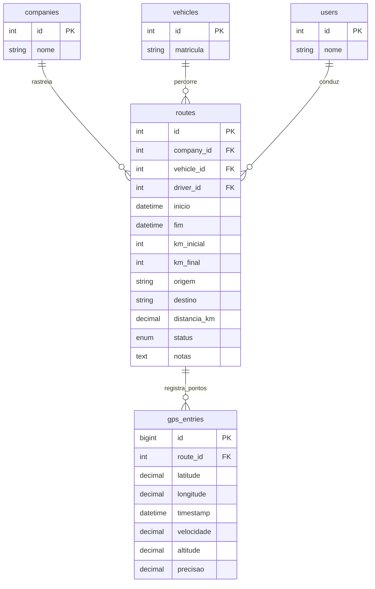

---

## 🔐 Sistema RBAC (Yii2 Native)

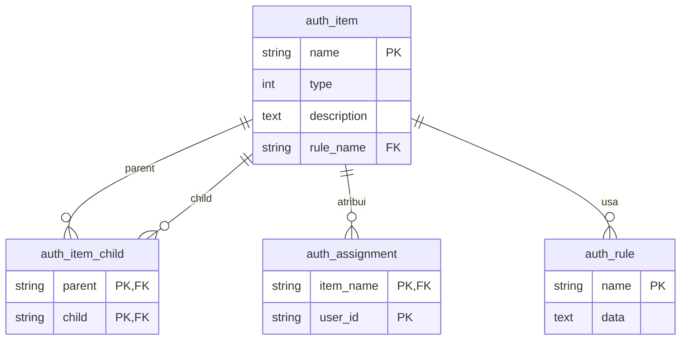

### Hierarquia RBAC Exemplo

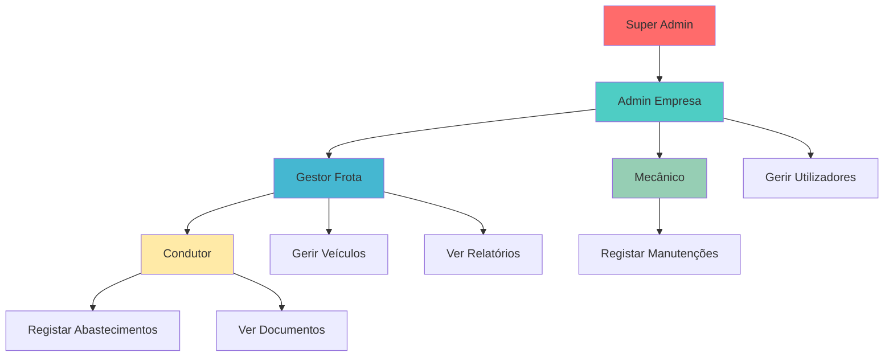

---

## 📈 Fluxos de Dados Principais

### Fluxo 1: Registo de Veículo

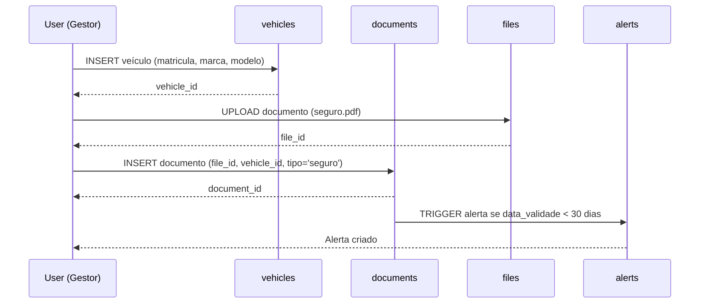

---

### Fluxo 2: Abastecimento

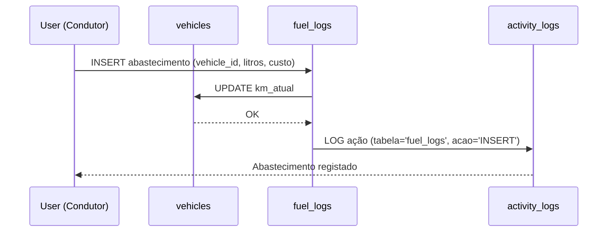

---

### Fluxo 3: Manutenção Agendada

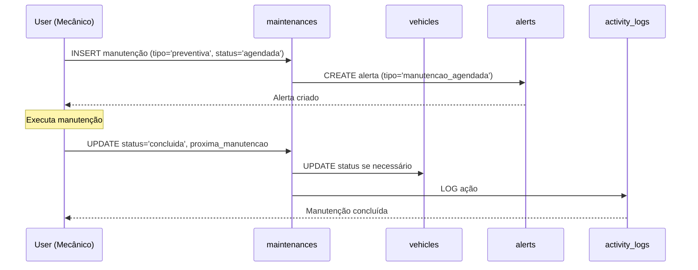

---

### Fluxo 4: Rastreamento GPS de Rota

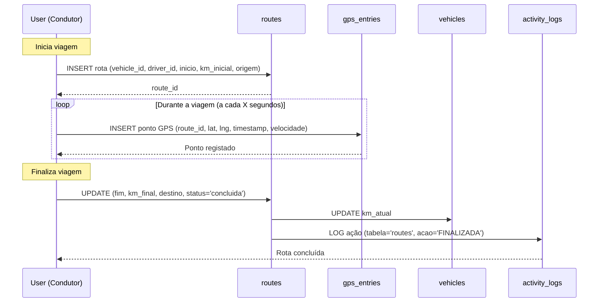

---

## 📊 Views (Relatórios)

### View: Documentos a Expirar

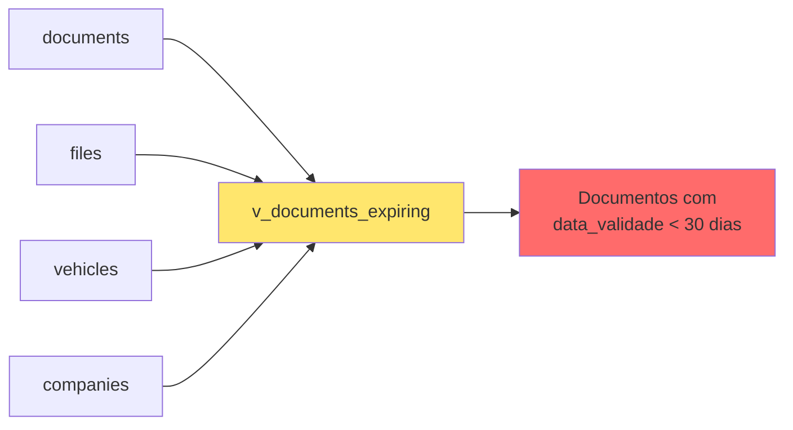

---

### View: Estatísticas da Empresa

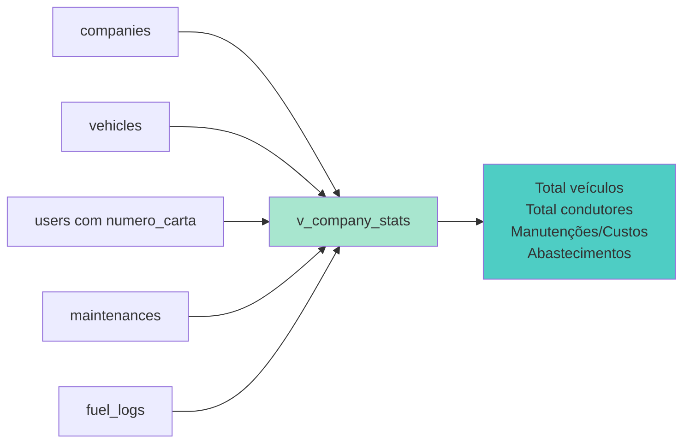

---

### View: Custos por Veículo

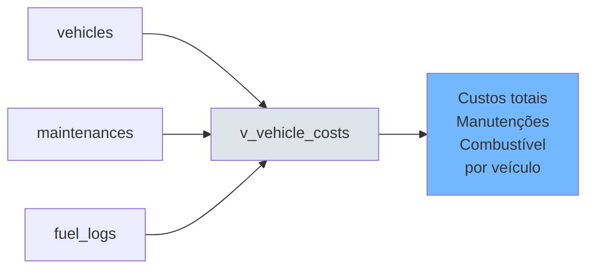

---

### View: Resumo de Rotas

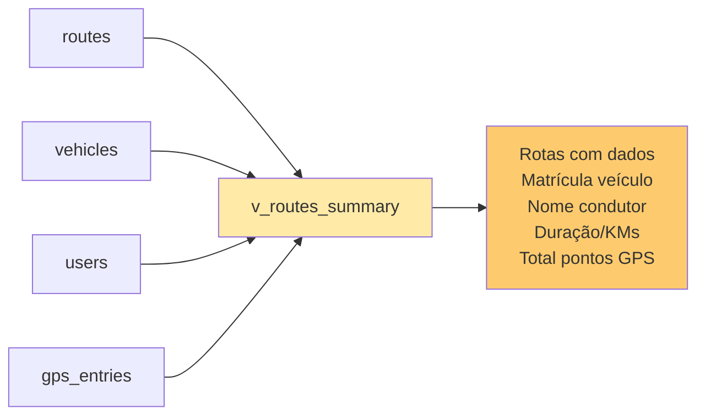

---

## 🎯 Cardinalidades

| Relação | Tipo | Descrição |
|---------|------|-----------|
| `companies` → `users` | **1:N** | Uma empresa tem vários utilizadores |
| `companies` → `vehicles` | **1:N** | Uma empresa tem vários veículos |
| `companies` → `routes` | **1:N** | Uma empresa tem várias rotas |
| `users` → `vehicles` | **1:N** | Um condutor pode ter vários veículos atribuídos |
| `users` → `routes` | **1:N** | Um condutor pode ter várias rotas |
| `vehicles` → `maintenances` | **1:N** | Um veículo tem várias manutenções |
| `vehicles` → `fuel_logs` | **1:N** | Um veículo tem vários abastecimentos |
| `vehicles` → `routes` | **1:N** | Um veículo percorre várias rotas |
| `routes` → `gps_entries` | **1:N** | Uma rota tem vários pontos GPS |
| `files` → `documents` | **1:N** | Um ficheiro pode ser usado em vários documentos |
| `documents` → `vehicles` | **N:1** | Vários documentos pertencem a 1 veículo |
| `documents` → `users` | **N:1** | Vários documentos pertencem a 1 condutor |
| `auth_item` → `auth_assignment` | **1:N** | Uma role/permission pode ser atribuída a vários users |

---

## 🔑 Índices Principais

```mermaid
graph TD
    A[Performance Crítica] --> B[company_id em TODAS as tabelas]
    A --> C[email UNIQUE em users]
    A --> D[matricula UNIQUE em vehicles]
    A --> E[vehicle_id em fuel_logs]
    A --> F[vehicle_id em maintenances]
    A --> G[file_id em documents]
    A --> H[Índices compostos RBAC]
    A --> I[route_id em gps_entries]
    A --> J[timestamp em gps_entries]
    A --> K[coordinates em gps_entries]
    
    style A fill:#ff6b6b
    style B fill:#4ecdc4
    style C fill:#4ecdc4
    style D fill:#4ecdc4
    style E fill:#4ecdc4
    style F fill:#4ecdc4
    style G fill:#4ecdc4
    style H fill:#4ecdc4
    style I fill:#4ecdc4
    style J fill:#4ecdc4
    style K fill:#4ecdc4
```

---

## 📦 Resumo da Estrutura

```
┌─────────────────────────────────────────────────────┐
│          VEIGEST v3.0 DATABASE STRUCTURE            │
├─────────────────────────────────────────────────────┤
│                                                     │
│  📁 CORE (2 tabelas)                                │
│    ├─ companies (Multi-tenant)                     │
│    └─ users (Com perfil condutor integrado)        │
│                                                     │
│  🚗 FROTA (3 tabelas)                               │
│    ├─ vehicles                                      │
│    ├─ maintenances                                  │
│    └─ fuel_logs                                     │
│                                                     │
│  📄 DOCUMENTOS (2 tabelas)                          │
│    ├─ files                                         │
│    └─ documents                                     │
│                                                     │
│  �️ ROTAS & GPS (2 tabelas)                         │
│    ├─ routes                                        │
│    └─ gps_entries                                   │
│                                                     │
│  �🔔 SISTEMA (2 tabelas)                             │
│    ├─ alerts                                        │
│    └─ activity_logs                                 │
│                                                     │
│  🔐 RBAC YII2 (4 tabelas)                           │
│    ├─ auth_rule                                     │
│    ├─ auth_item                                     │
│    ├─ auth_item_child                               │
│    └─ auth_assignment                               │
│                                                     │
│  📊 VIEWS (4 relatórios)                            │
│    ├─ v_documents_expiring                          │
│    ├─ v_company_stats                               │
│    ├─ v_vehicle_costs                               │
│    └─ v_routes_summary                              │
│                                                     │
│  TOTAL: 14 tabelas + 4 views = 18 objetos          │
│                                                     │
└─────────────────────────────────────────────────────┘
```

---

## 🎨 Como Usar os Diagramas

### No GitHub / GitLab
Os diagramas Mermaid são renderizados automaticamente em Markdown.

### No VS Code
1. Instalar extensão: **Markdown Preview Mermaid Support**
2. Abrir Preview: `Ctrl+Shift+V`

### Online
Copiar código Mermaid para: https://mermaid.live/

### Exportar como Imagem
1. Aceder: https://mermaid.live/
2. Colar código
3. Download PNG/SVG

---

## 📚 Documentação Relacionada

- 📄 **schema_simplifyed.sql** - Schema SQL completo
- 📋 **REVISION_2_CHANGELOG.md** - Mudanças da v3.0
- 📖 **README_NEW.md** - Guia principal
- 🔐 **RBAC_YII2_GUIDE.md** - Guia RBAC
- 📊 **USEFUL_QUERIES.md** - Queries prontas

---

**Versão:** 3.0 (Ultra-Lean)  
**Data:** 6 de novembro de 2025  
**Autor:** VeiGest Team  
**Status:** ✅ Atualizado
